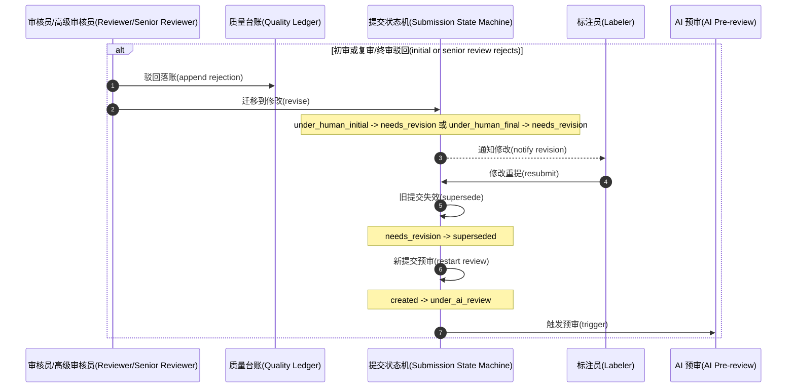

# LabelHub Core Flow Revision Branch

## 取证结论

- 打回分支状态以 `docs/workflows/state-machine-submission.md` 为准：`under_human_initial -> needs_revision`、`under_human_final -> needs_revision`、`needs_revision -> superseded`、新提交再进入 `created -> under_ai_review`。
- 打回 entry 仍写入 `quality_ledger_entries`，台账只保存 append-only evidence，不发起 submission 状态迁移。
- `needs_revision -> superseded` 的 Actor 是 `Labeler`，Guard 是 `labeler submits corrected version`。

## 明细(Details)

| 元素 | 关键细节 | 实证来源 |
| --- | --- | --- |
| 初审驳回 | `under_human_initial -> needs_revision`，Guard 为 `reject reason provided`，Actor 为 `Reviewer`。 | `docs/workflows/state-machine-submission.md:11` |
| 复审/终审驳回 | `under_human_final -> needs_revision`，Guard 为 `reject reason provided`，Actor 为 `Reviewer`。 | `docs/workflows/state-machine-submission.md:15` |
| 修改后重提 | `needs_revision -> superseded`，Guard 为 `labeler submits corrected version`，Actor 为 `Labeler`。 | `docs/workflows/state-machine-submission.md:16` |
| 新提交进入预审 | 新提交从 `created -> under_ai_review`，Guard 为 `submission persisted and outbox event written`，Actor 为 `API`。 | `docs/workflows/state-machine-submission.md:7` |
| 证据落账 | 打回 entry 属于 human review evidence，存入 `quality_ledger_entries`，`current_verdicts` 派生。 | `docs/adr/ADR-003-quality-ledger.md`、`services/api/src/main/java/com/labelhub/api/module/quality/service/LedgerService.java` |

## 实证来源

- 提交状态机的打回与重提迁移：`docs/workflows/state-machine-submission.md` 第 11、15、16、7 行。
- Quality Ledger 作为 append-only evidence、`current_verdicts` 为派生视图：`docs/adr/ADR-003-quality-ledger.md`。
- AI evidence 不直接裁决最终 verdict：`docs/adr/ADR-005-ai-evidence-not-verdict.md`。
- Reviewer / Senior Reviewer review level：`packages/contracts/openapi/labelhub.yaml` 的 `ReviewLevel`、`services/api/src/main/java/com/labelhub/api/module/quality/service/ReviewLevels.java`、`services/api/src/main/java/com/labelhub/api/module/quality/service/LedgerService.java`。
