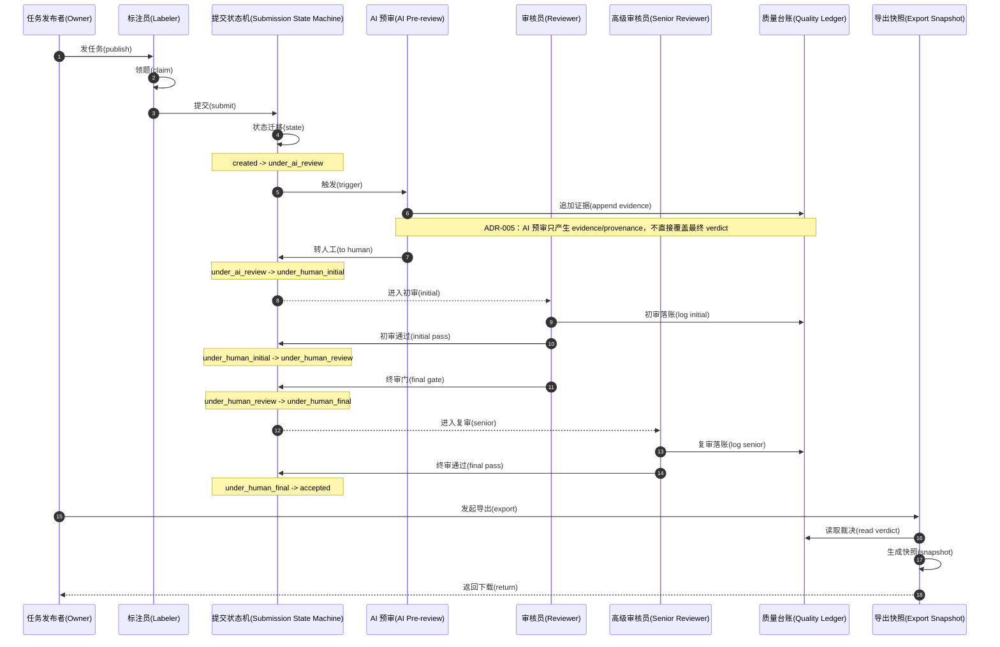

# LabelHub Core Flow Sequence

打回与重提分支见 `core-flow-revision.md`。

## 取证结论

- 主链路状态以 `docs/workflows/state-machine-submission.md` 为准：`created` -> `under_ai_review` -> `under_human_initial` -> `under_human_review` -> `under_human_final` -> `accepted`。
- `under_human_review -> under_human_final` 的 Actor 是 `Reviewer`，Guard 是 `dispute or configured final gate`，因此图中由 Reviewer 触发该门控迁移。
- AI 预审输出写入证据，不直接拥有最终 verdict；这与 ADR-005、ADR-003 的 append-only ledger 设计一致。
- 可信导出以 `export_snapshots` 的不可变快照承载 file hash、schema versions、rule version 和 field mapping snapshot。

## 明细(Details)

| 元素 | 关键细节 | 实证来源 |
| --- | --- | --- |
| AI 证据落账 | AI evidence 写入 `quality_ledger_entries`，`current_verdicts` 是派生视图。 | `docs/adr/ADR-003-quality-ledger.md`、`docs/adr/ADR-005-ai-evidence-not-verdict.md` |
| Reviewer 初审 | `under_human_initial -> under_human_review`，Guard 为 `initial reviewer approves`，Actor 为 `Reviewer`。 | `docs/workflows/state-machine-submission.md:10` |
| Reviewer 触发复审/终审门控 | `under_human_review -> under_human_final`，Guard 为 `dispute or configured final gate`，Actor 为 `Reviewer`。 | `docs/workflows/state-machine-submission.md:13` |
| Senior Reviewer 通过 | `under_human_final -> accepted`，Guard 为 `final reviewer approves`，Actor 为 `Reviewer`。 | `docs/workflows/state-machine-submission.md:14` |
| Trusted Export | 每次导出创建 immutable snapshot，包含 file hash、schema version list、verdict rule version、data scope、field mapping snapshot、canonicalization version。 | `docs/adr/ADR-004-export-snapshot.md` |

## 实证来源

- 提交状态机的状态名与迁移：`docs/workflows/state-machine-submission.md`，尤其第 7、8、10、13、14 行。
- AI evidence 不直接裁决最终 verdict：`docs/adr/ADR-005-ai-evidence-not-verdict.md`。
- Quality Ledger 作为 append-only evidence、`current_verdicts` 为派生视图：`docs/adr/ADR-003-quality-ledger.md`。
- Export Snapshot 不可变快照字段：`docs/adr/ADR-004-export-snapshot.md`、`docs/architecture/labelhub-complete-design-baseline.md`。
- AI evidence 落账实现：`services/api/src/main/java/com/labelhub/api/module/ai/service/AiReviewService.java`、`services/api/src/main/java/com/labelhub/api/module/quality/service/LedgerService.java`。
- Reviewer / Senior Reviewer review level：`packages/contracts/openapi/labelhub.yaml` 的 `ReviewLevel`、`services/api/src/main/java/com/labelhub/api/module/quality/service/ReviewLevels.java`、`services/api/src/main/java/com/labelhub/api/module/quality/service/LedgerService.java`。
- 导出任务与快照实现：`services/api/src/main/java/com/labelhub/api/module/export/`、`services/agent/src/main/java/com/labelhub/agent/outbox/OutboxExportWorker.java`。
