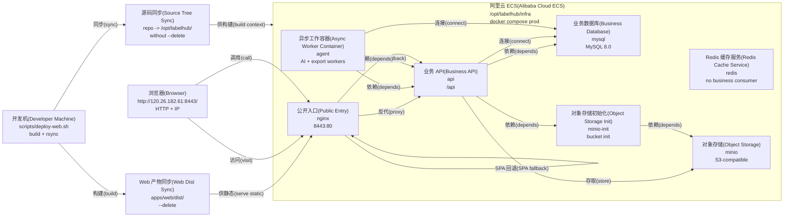

# LabelHub Deployment

## 取证结论

- 当前生产目标是单台阿里云 ECS，部署根目录 `/opt/labelhub`，由 `docker compose --env-file .env.prod -f docker-compose.prod.yml up -d --build` 启动。
- `scripts/deploy-web.sh` 在开发机执行 Web build，然后用 `rsync` 同步 `apps/web/dist/` 到 `/opt/labelhub/infra/web-dist/`，并同步源码到 `/opt/labelhub/`。
- 公开访问路径仍是 `http://120.26.182.61:8443/`，`nginx` 只做 `8443:80` 映射；ICP备案与 HTTPS 证书切换尚未完成。`127.0.0.1:5173` 仅是本机 Vite 开发地址,不属于生产入口。
- 生产 compose 实际包含 `mysql`、`redis`、`minio`、`minio-init`、`api`、`agent`、`nginx`；公网只暴露 `nginx`，其他端口在 compose 网络内使用。
- Redis 补查命中仅限 `infra/docker-compose.yml` 与 `infra/docker-compose.prod.yml` 的服务定义/healthcheck，未发现业务消费者，属于候选裁剪项。

## 明细(Details)

### 节点明细(Node Details)

| 节点 | 关键细节 | 实证来源 |
| --- | --- | --- |
| 开发机(Developer Machine) | `scripts/deploy-web.sh` 执行 `pnpm --filter @labelhub/web build`，然后 rsync Web dist 与源码。 | `scripts/deploy-web.sh`、`docs/dev-environment.md` |
| Web 产物同步(Web Dist Sync) | `apps/web/dist/` 同步到 `root@120.26.182.61:/opt/labelhub/infra/web-dist/`，使用 `--delete`。 | `scripts/deploy-web.sh`、`infra/deploy/README.md` |
| 源码同步(Source Tree Sync) | 源码同步到 `/opt/labelhub/`，保留 `.env*.example`，排除 `node_modules`、`.git`、`dist`、`.env`、`.env.*`、`.env.prod`、`web-dist`、`.DS_Store`、`.pnpm-store`、`.claude`、`.codex`、`application-secrets.yml`、`logs`、`*.log`、`coverage`、`*.tsbuildinfo`、`mysql-data`、`minio-data`、`target`、根目录 `*.bundle`、`submission`、`docs/screenshots`、`docs/design-assets`。 | `scripts/deploy-web.sh`、`docs/dev-environment.md` |
| 浏览器(Browser) | 当前公网入口为 `http://120.26.182.61:8443/`；ICP备案与 HTTPS 证书切换尚未完成。 | `infra/deploy/README.md`、`infra/docker-compose.prod.yml` |
| 阿里云 ECS(Alibaba Cloud ECS) | 单机 Ubuntu 24.04，部署根目录 `/opt/labelhub`，compose 在 `/opt/labelhub/infra` 执行。 | `infra/deploy/README.md` |
| nginx | image `nginx:1.27-alpine`；公开端口映射 `8443:80`；挂载 `./web-dist:/usr/share/nginx/html:ro` 与 `./nginx/labelhub.conf:/etc/nginx/conf.d/default.conf:ro`。 | `infra/docker-compose.prod.yml`、`infra/nginx/labelhub.conf` |
| api | build `services/api/Dockerfile`；container port `8080`；context path `/api`；health `http://localhost:8080/api/actuator/health`；mem_limit `1280m`。 | `infra/docker-compose.prod.yml`、`services/api/src/main/resources/application.yml` |
| agent | build `services/agent/Dockerfile`；container port `8081`；health `http://localhost:8081/actuator/health`；运行 AI review 与 export outbox workers；mem_limit `768m`。 | `infra/docker-compose.prod.yml`、`services/agent/src/main/resources/application.yml`、`services/agent/src/main/java/com/labelhub/agent/outbox/` |
| mysql | image `mysql:8.0`；volume `labelhub-mysql-data`；container port `3306`；healthcheck `mysqladmin ping`。 | `infra/docker-compose.prod.yml` |
| redis | image `redis:7-alpine`；container port `6379`；healthcheck `redis-cli ping`；grep 未发现业务消费者。 | `infra/docker-compose.prod.yml`、`infra/docker-compose.yml` |
| minio | image `minio/minio:latest`；container ports `9000` API / `9001` console；volume `labelhub-minio-data`。 | `infra/docker-compose.prod.yml` |
| minio-init | image `minio/mc:latest`；通过 `mc mb --ignore-existing` 创建 `${OBJECT_STORAGE_BUCKET:-labelhub-exports}`。 | `infra/docker-compose.prod.yml` |

### 连线明细(Edge Details)

| 连线 | 细节 | 实证来源 |
| --- | --- | --- |
| dev -> dist_sync | 本地 Web build 后同步 dist，dry-run 时仍 build，但 rsync 加 `-n --itemize-changes`。 | `scripts/deploy-web.sh` |
| dev -> source_sync | 源码同步不带 `--delete`，避免远端运行目录被清空。 | `scripts/deploy-web.sh` |
| browser -> nginx | 公开入口是 HTTP + IP direct；当前 compose 只暴露 `nginx` 的 `8443:80`。 | `infra/deploy/README.md`、`infra/docker-compose.prod.yml` |
| nginx -> api | `location /api/` 使用 `proxy_pass http://api:8080`。 | `infra/nginx/labelhub.conf` |
| nginx -> nginx | `location /` 使用 `try_files $uri $uri/ /index.html` 支撑 SPA fallback。 | `infra/nginx/labelhub.conf` |
| api -> mysql | `DATABASE_URL` 默认 `jdbc:mysql://mysql:3306/labelhub?...`；`depends_on mysql: service_healthy`。 | `infra/docker-compose.prod.yml` |
| api -> minio-init / minio | `api` depends on `minio-init: service_started`；对象存储 endpoint 默认 `http://minio:9000`。 | `infra/docker-compose.prod.yml`、`services/api/src/main/resources/application.yml` |
| minio-init -> minio | `minio-init` depends on `minio: service_started`，并通过 `http://minio:9000` 初始化 bucket。 | `infra/docker-compose.prod.yml` |
| agent -> api | `agent` depends on `api: service_healthy`；`LABELHUB_API_BASE_URL` 默认 `http://api:8080/api`。 | `infra/docker-compose.prod.yml`、`services/agent/src/main/resources/application.yml` |
| agent -> mysql | `agent` 使用 `SPRING_DATASOURCE_URL`、`SPRING_DATASOURCE_USERNAME`、`SPRING_DATASOURCE_PASSWORD` 连接数据库并轮询 outbox。 | `infra/docker-compose.prod.yml`、`services/agent/src/main/java/com/labelhub/agent/outbox/` |

## 实证来源

- 生产 compose 容器、端口、依赖和环境变量：`infra/docker-compose.prod.yml`。
- Nginx 静态资源根目录与 `/api/` 反向代理：`infra/nginx/labelhub.conf`。
- 单 ECS、8443 公网入口、HTTP IP 访问与 TLS cutover 说明：`infra/deploy/README.md`。
- Web build 与 rsync 部署路径：`scripts/deploy-web.sh`、`docs/dev-environment.md`。
- API context path、默认端口、对象存储和数据库配置：`services/api/src/main/resources/application.yml`。
- Agent 端口、API base URL、outbox worker 配置和 LLM env 配置：`services/agent/src/main/resources/application.yml`。
- Agent 同一进程内包含 AI review 与 export outbox worker：`services/agent/src/main/java/com/labelhub/agent/outbox/OutboxAiReviewWorker.java`、`services/agent/src/main/java/com/labelhub/agent/outbox/OutboxExportWorker.java`。
- Redis 补查命中清单：`infra/docker-compose.yml`、`infra/docker-compose.prod.yml`；未命中 `services/`、`apps/`、`packages/` 业务代码。
