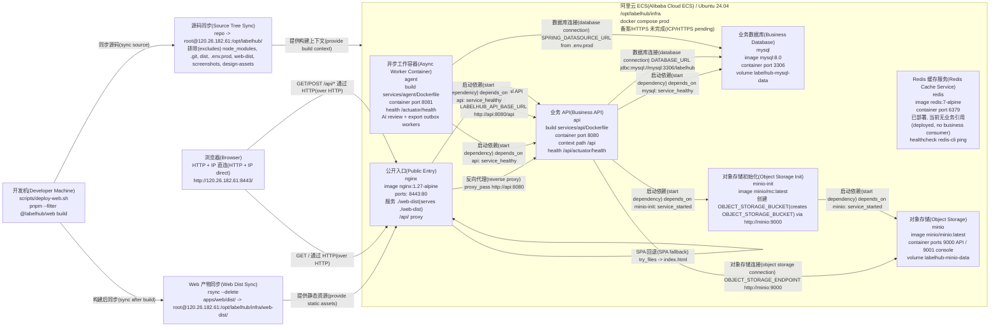

# LabelHub Deployment

## 取证结论

- 当前生产目标是单台阿里云 ECS，部署根目录 `/opt/labelhub`，由 `docker compose --env-file .env.prod -f docker-compose.prod.yml up -d --build` 启动。
- `scripts/deploy-web.sh` 在开发机执行 Web build，然后用 `rsync` 同步 `apps/web/dist/` 到 `/opt/labelhub/infra/web-dist/`，并同步源码到 `/opt/labelhub/`。
- 公开访问路径仍是 `http://120.26.182.61:8443/`，`nginx` 只做 `8443:80` 映射；ICP备案与 HTTPS 证书切换尚未完成。
- 生产 compose 实际包含 `mysql`、`redis`、`minio`、`minio-init`、`api`、`agent`、`nginx`；公网只暴露 `nginx`，其他端口在 compose 网络内使用。
- Redis 补查使用 `grep -rn -i "redis" services/ apps/ packages/ infra/ --include="*.java" --include="*.ts" --include="*.tsx" --include="*.yml" --include="*.yaml" --include="*.conf"`；命中仅限 `infra/docker-compose.yml` 与 `infra/docker-compose.prod.yml` 的服务定义/healthcheck，未发现业务消费者，属于候选裁剪项。

## 实证来源

- 生产 compose 容器、端口、依赖和环境变量：`infra/docker-compose.prod.yml`。
- Nginx 静态资源根目录与 `/api/` 反向代理：`infra/nginx/labelhub.conf`。
- 单 ECS、8443 公网入口、HTTP IP 访问与 TLS cutover 说明：`infra/deploy/README.md`。
- Web build 与 rsync 部署路径：`scripts/deploy-web.sh`、`docs/dev-environment.md`。
- API context path、默认端口、对象存储和数据库配置：`services/api/src/main/resources/application.yml`。
- Agent 端口、API base URL、outbox worker 配置和 LLM env 配置：`services/agent/src/main/resources/application.yml`。
- Agent 同一进程内包含 AI review 与 export outbox worker：`services/agent/src/main/java/com/labelhub/agent/outbox/OutboxAiReviewWorker.java`、`services/agent/src/main/java/com/labelhub/agent/outbox/OutboxExportWorker.java`。
- Redis 补查命中清单：`infra/docker-compose.yml`、`infra/docker-compose.prod.yml`；未命中 `services/`、`apps/`、`packages/` 业务代码。
