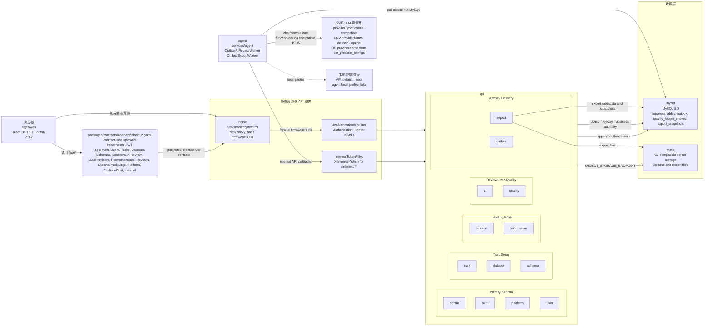

# LabelHub System Overview

## 取证结论

- 后端边界是 `services/api` 模块化单体；实际模块清单来自 `services/api/src/main/java/com/labelhub/api/module/`，不是旧基线里的七模块简写。
- 前端是 `apps/web`，依赖 `react`/`react-dom` 18.x 与 `@formily/*` 2.x；API 类型由 `packages/contracts/openapi/labelhub.yaml` 生成。
- 生产入口是 `nginx` 服务：静态资源来自 `infra/web-dist`，`/api/` 反代到 `api:8080`；JWT 在 Spring Security 的 `JwtAuthenticationFilter` 处校验。
- AI 调用的运行态 provider 以 `openai-compatible` 为 provider type，环境 fallback 的 provider name 是 `doubao` 或 `openai`；本地 profile 有 `fake`，API 内置默认有 `mock`。

## 实证来源

- 模块化单体决策：`docs/adr/ADR-001-modular-monolith.md`。
- 基线模块划分与架构叙述：`docs/architecture/labelhub-complete-design-baseline.md`。
- 实际模块清单：`services/api/src/main/java/com/labelhub/api/module/` 下的 `admin`、`ai`、`auth`、`dataset`、`export`、`outbox`、`platform`、`quality`、`schema`、`session`、`submission`、`task`、`user`。
- 前端 React/Formily 依据：`apps/web/package.json`、`apps/web/src/features/labeling/formily/SchemaFormilyRenderer.tsx`。
- Contract-first OpenAPI 与 tag 列表：`docs/adr/ADR-012-contract-first-openapi.md`、`packages/contracts/openapi/labelhub.yaml`。
- JWT 认证位置：`services/api/src/main/java/com/labelhub/api/config/SecurityConfig.java`、`services/api/src/main/java/com/labelhub/api/security/JwtAuthenticationFilter.java`、`packages/contracts/openapi/labelhub.yaml` 的 `bearerAuth`。
- 静态资源与 API 反代：`infra/docker-compose.prod.yml` 的 `nginx` 服务、`infra/nginx/labelhub.conf`。
- MySQL/MinIO 数据层：`infra/docker-compose.prod.yml` 的 `mysql`、`minio`、`minio-init`、`api` 环境变量。
- AI provider 运行态：`services/agent/src/main/java/com/labelhub/agent/llm/runtime/EnvRuntimeProviderSourceFactory.java`、`services/agent/src/main/java/com/labelhub/agent/llm/runtime/RegistryBackedAiReviewProvider.java`、`services/agent/src/main/java/com/labelhub/agent/llm/runtime/OpenAiCompatibleAiReviewRuntimeClient.java`、`services/agent/src/main/java/com/labelhub/agent/llm/FakeAiReviewProvider.java`。
- API 侧 provider 抽象与默认替身：`services/api/src/main/resources/application.yml`、`services/api/src/main/java/com/labelhub/api/module/ai/provider/OpenAiCompatibleProvider.java`、`services/api/src/main/java/com/labelhub/api/module/ai/provider/MockAiProvider.java`。
