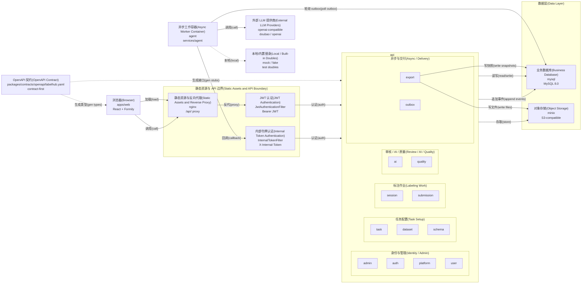

# LabelHub System Overview

## 取证结论

- 后端边界是 `services/api` 模块化单体；实际模块清单来自 `services/api/src/main/java/com/labelhub/api/module/`，不是旧基线里的七模块简写。
- 前端是 `apps/web`；OpenAPI 契约是设计期产物，不在运行时请求链路上。
- 生产入口是 `nginx` 服务：浏览器运行时请求只走 `browser -> nginx -> JwtAuthenticationFilter -> api`。
- AI 调用的运行态 provider 以 `openai-compatible` 为 provider type，环境 fallback 的 provider name 是 `doubao` 或 `openai`；本地 profile 有 `fake`，API 内置默认有 `mock`。

## 明细(Details)

### 节点明细(Node Details)

| 节点 | 关键细节 | 实证来源 |
| --- | --- | --- |
| 浏览器(Browser) | `apps/web` 依赖 `react` / `react-dom` `^18.3.1`，`@formily/core` / `@formily/react` `^2.3.2`；API 类型由 OpenAPI 生成。 | `apps/web/package.json`、`apps/web/src/features/labeling/formily/SchemaFormilyRenderer.tsx` |
| OpenAPI 契约(OpenAPI Contract) | `packages/contracts/openapi/labelhub.yaml` 是 contract-first 源头；tags 为 `Auth`、`Users`、`Tasks`、`Datasets`、`Schemas`、`Sessions`、`AIReview`、`LLMProviders`、`PromptVersions`、`Reviews`、`Exports`、`AuditLogs`、`Platform`、`PlatformCost`、`Internal`。 | `docs/adr/ADR-012-contract-first-openapi.md`、`packages/contracts/openapi/labelhub.yaml` |
| 静态资源与反向代理(Static Assets and Reverse Proxy) | `nginx` 服务静态根目录为 `/usr/share/nginx/html`，`/api/` 反代到 `http://api:8080`。 | `infra/docker-compose.prod.yml`、`infra/nginx/labelhub.conf` |
| JWT 认证(JWT Authentication) | `SecurityConfig` 将 `JwtAuthenticationFilter` 放入 Spring Security filter chain；OpenAPI 声明 `bearerAuth` JWT。 | `services/api/src/main/java/com/labelhub/api/config/SecurityConfig.java`、`services/api/src/main/java/com/labelhub/api/security/JwtAuthenticationFilter.java`、`packages/contracts/openapi/labelhub.yaml` |
| 内部令牌认证(Internal Token Authentication) | Agent 调用 `/internal/**` 时使用 `X-Internal-Token`。 | `services/api/src/main/java/com/labelhub/api/config/SecurityConfig.java`、`services/agent/src/main/java/com/labelhub/agent/api/WebClientAiReviewApiClient.java`、`services/agent/src/main/java/com/labelhub/agent/api/WebClientExportApiClient.java` |
| api | 后端是 `services/api` 模块化单体；实际模块为 `admin`、`ai`、`auth`、`dataset`、`export`、`outbox`、`platform`、`quality`、`schema`、`session`、`submission`、`task`、`user`。 | `docs/adr/ADR-001-modular-monolith.md`、`services/api/src/main/java/com/labelhub/api/module/` |
| agent | `services/agent` 独立容器内运行 `OutboxAiReviewWorker` 与 `OutboxExportWorker`。 | `infra/docker-compose.prod.yml`、`services/agent/src/main/java/com/labelhub/agent/outbox/OutboxAiReviewWorker.java`、`services/agent/src/main/java/com/labelhub/agent/outbox/OutboxExportWorker.java` |
| 业务数据库(Business Database) | `mysql` 使用 MySQL 8.0；承载业务表、`outbox`、`quality_ledger_entries`、`export_snapshots`。 | `infra/docker-compose.prod.yml`、`services/api/src/main/resources/db/migration/` |
| 对象存储(Object Storage) | `minio` 作为 S3-compatible object storage，保存上传文件与导出文件。 | `infra/docker-compose.prod.yml`、`services/api/src/main/resources/application.yml` |
| 外部 LLM 提供商(External LLM Providers) | Agent 运行态只支持 `openai-compatible` provider type；环境 fallback providerName 为 `doubao` 或 `openai`；DB providerName 来自 `llm_provider_configs`。 | `services/agent/src/main/java/com/labelhub/agent/llm/runtime/EnvRuntimeProviderSourceFactory.java`、`services/agent/src/main/java/com/labelhub/agent/llm/runtime/RegistryBackedAiReviewProvider.java`、`services/agent/src/main/java/com/labelhub/agent/llm/runtime/JdbcRuntimeProviderConfigRepository.java` |
| 本地/内置替身(Local / Built-in Doubles) | API 默认 provider 为 `mock` / `mock-v1`；agent local profile 使用 `fake` / `fake-v1`。 | `services/api/src/main/resources/application.yml`、`services/api/src/main/java/com/labelhub/api/module/ai/provider/MockAiProvider.java`、`services/agent/src/main/java/com/labelhub/agent/llm/FakeAiReviewProvider.java` |

### 连线明细(Edge Details)

| 连线 | 细节 | 实证来源 |
| --- | --- | --- |
| 浏览器 -> nginx | 浏览器加载静态资源，并通过同一入口调用 `/api/*`。 | `infra/nginx/labelhub.conf` |
| OpenAPI 契约 -> 浏览器 | `openapi-typescript ../../packages/contracts/openapi/labelhub.yaml -o src/shared/api/generated/schema.d.ts` 生成前端类型。 | `apps/web/package.json` |
| OpenAPI 契约 -> api | Java 接口和 TypeScript client types 均从 `labelhub.yaml` 生成，契约不在运行时请求链路上。 | `docs/adr/ADR-012-contract-first-openapi.md` |
| nginx -> JwtAuthenticationFilter -> api | `/api/` 使用 `proxy_pass http://api:8080`，JWT 通过 `Authorization: Bearer <JWT>` 校验。 | `infra/nginx/labelhub.conf`、`services/api/src/main/java/com/labelhub/api/security/JwtAuthenticationFilter.java` |
| api -> mysql | API 通过 `DATABASE_URL` 连接 MySQL，并由 Flyway 管理迁移。 | `infra/docker-compose.prod.yml`、`services/api/src/main/resources/application.yml` |
| api -> minio | API 通过 `OBJECT_STORAGE_ENDPOINT` 等对象存储配置访问 MinIO。 | `infra/docker-compose.prod.yml`、`services/api/src/main/resources/application.yml` |
| api -> mysql outbox | API 追加 outbox 事件，agent 轮询处理 AI review 和 export job。 | `docs/adr/ADR-008-outbox-pattern.md`、`services/agent/src/main/java/com/labelhub/agent/outbox/` |
| agent -> api internal | Agent 使用 `LABELHUB_API_BASE_URL` 和 `LABELHUB_INTERNAL_TOKEN` 回调 API 内部端点。 | `infra/docker-compose.prod.yml`、`services/agent/src/main/resources/application.yml` |
| agent -> 外部 LLM 提供商 | Agent 调用 `/chat/completions` 并要求 function-calling compatible JSON。 | `services/agent/src/main/java/com/labelhub/agent/llm/runtime/OpenAiCompatibleAiReviewRuntimeClient.java` |
| export -> mysql / minio | `export` 模块写 `export_snapshots` 元数据，生成文件写入对象存储。 | `docs/adr/ADR-004-export-snapshot.md`、`services/api/src/main/java/com/labelhub/api/module/export/` |

## 实证来源

- 模块化单体决策：`docs/adr/ADR-001-modular-monolith.md`。
- 基线模块划分与架构叙述：`docs/architecture/labelhub-complete-design-baseline.md`。
- Contract-first OpenAPI：`docs/adr/ADR-012-contract-first-openapi.md`、`packages/contracts/openapi/labelhub.yaml`。
- 生产静态入口、API 反代与数据层：`infra/docker-compose.prod.yml`、`infra/nginx/labelhub.conf`。
- JWT 与内部令牌认证：`services/api/src/main/java/com/labelhub/api/config/SecurityConfig.java`、`services/api/src/main/java/com/labelhub/api/security/JwtAuthenticationFilter.java`。
- AI provider 运行态：`services/agent/src/main/java/com/labelhub/agent/llm/runtime/`、`services/api/src/main/java/com/labelhub/api/module/ai/provider/`。
