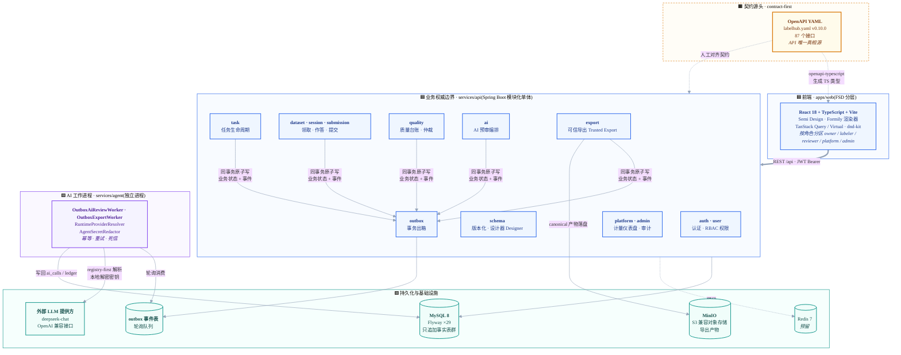
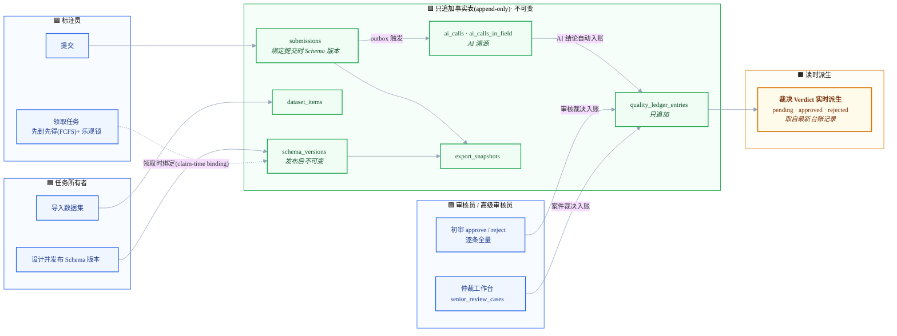
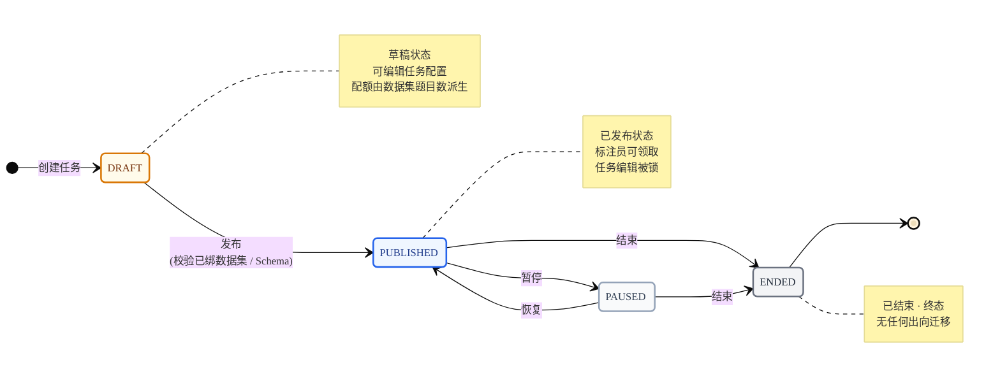
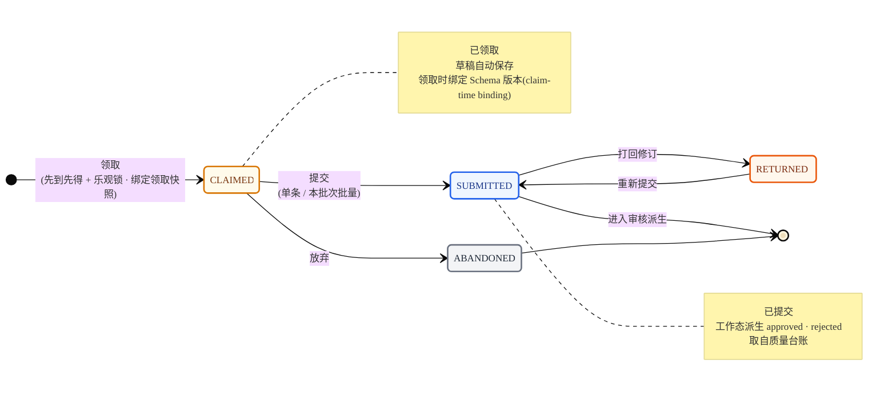
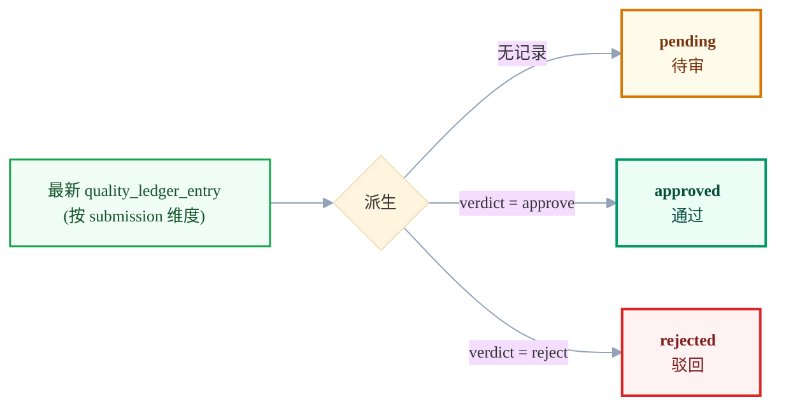
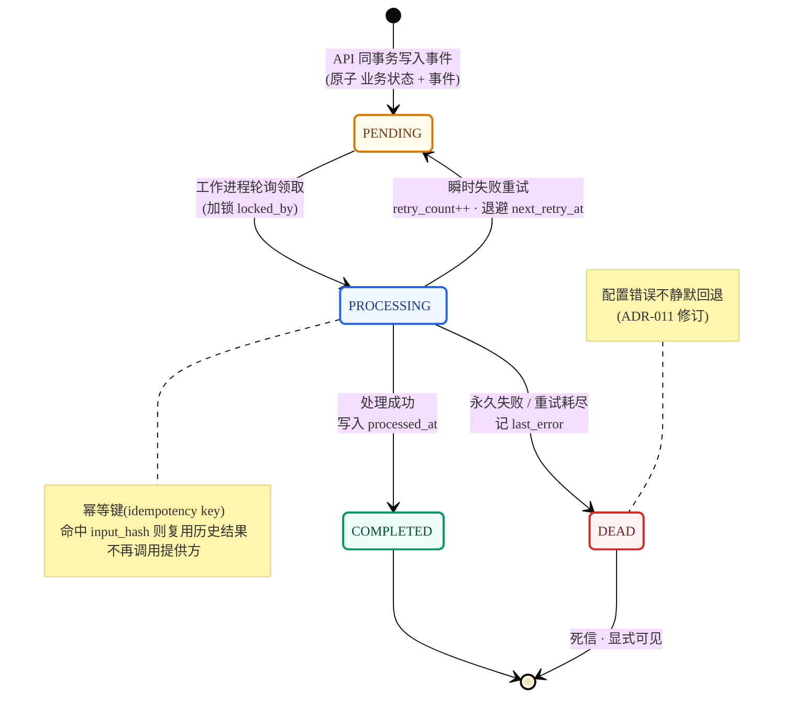
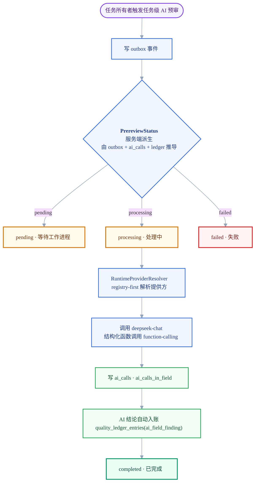
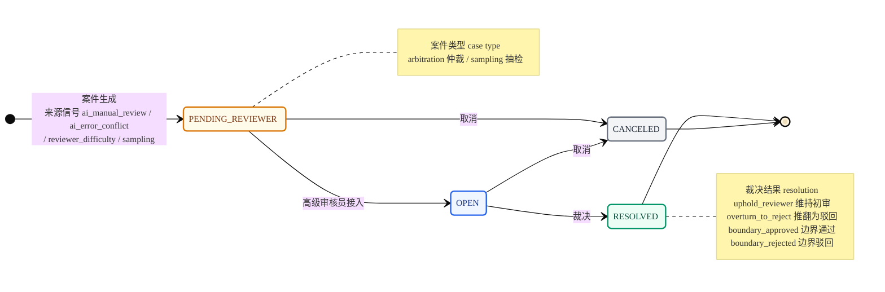
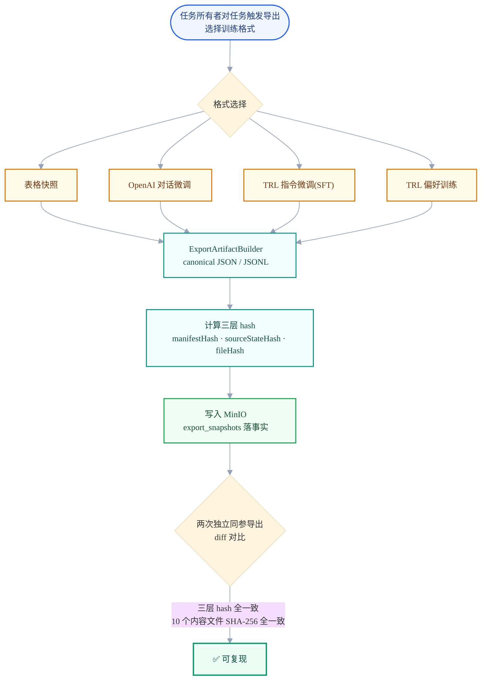
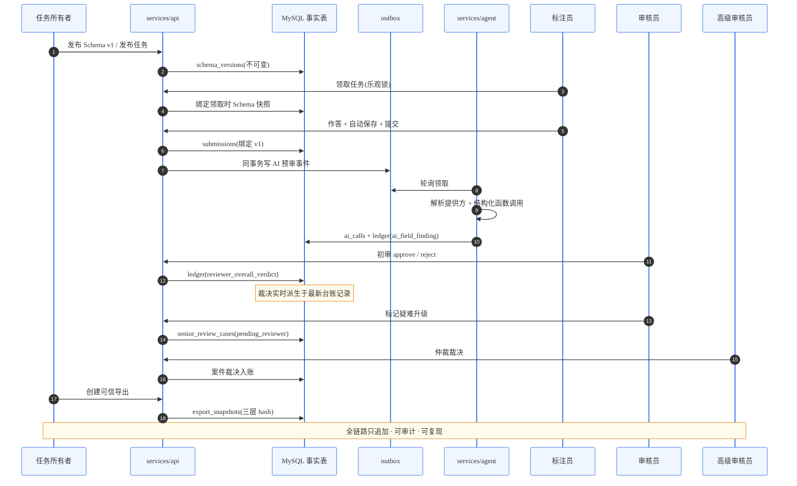

# LabelHub 架构图与状态机流程图

> 本文档基于代码实际真相绘制(`TaskStateTransitions.java`、OpenAPI 枚举、Flyway 迁移、ADR)。原则:代码标识符、产品/类名与少数固定术语保留英文,其余一律用中文;所有图为 Mermaid 格式,可在 GitHub / VS Code / Typora 直接渲染。
>
> **角色中英对照**:任务所有者(Owner)· 标注员(Labeler)· 审核员(Reviewer)· 高级审核员(Senior Reviewer)。

## 配色语义

全文统一一套语义色板,跨所有图保持一致:

| 颜色 | 含义 | 用途示例 |
|------|------|----------|
| 🟦 蓝 | 业务核心 / 进行中 | API 边界、PUBLISHED、PROCESSING |
| 🟩 绿 | 成功 / 通过 / 事实表 | approved、completed、只追加事实 |
| 🟧 琥珀 | 待处理 / 派生 / 草稿 | pending、读时派生、DRAFT |
| 🟥 红 | 失败 / 驳回 | rejected、failed、死信 |
| 🟪 紫 | 独立工作进程 / AI | services/agent、AI 预审 |
| ⬜ 灰 | 终态 / 预留 | ENDED、RESOLVED、预留 |

---

## 一、系统架构图

模块化单体 + 独立 AI 工作进程双进程,契约先行(contract-first)。

---

## 二、领域分层与数据流

强调只追加(append-only)事实流与裁决(Verdict)实时派生。

---

## 三、任务状态机

> 真相源:`TaskStateTransitions.java` + 迁移约束 `chk_tasks_status`。状态严格四态,迁移由白名单守护;每次迁移写入 `task_transitions` 事实。

**迁移白名单(代码原文)**

| 起始 \ 目标 | DRAFT | PUBLISHED | PAUSED | ENDED |
|-----------|:-----:|:---------:|:------:|:-----:|
| **DRAFT** | — | ✅ | ✗ | ✗ |
| **PUBLISHED** | ✗ | — | ✅ | ✅ |
| **PAUSED** | ✗ | ✅ | — | ✅ |
| **ENDED** | ✗ | ✗ | ✗ | — |

---

## 四、标注会话状态机

> 真相源:OpenAPI `SessionStatus` 与 `LabelerSessionWorkStatus`。会话持久态(claimed / submitted / …)与派生工作态(含 approved / rejected)分离。

**会话最终裁决派生(读时计算,无物化表)**

---

## 五、AI 预审与 outbox 状态机

> 真相源:`outbox` 表 status 字段、`PrereviewStatus`、`AiCallStatus`、ADR-008/011。AI 是证据非裁决(ADR-005),输出强制结构化函数调用(function-calling,ADR-006)。

### 5.1 outbox 事件生命周期

### 5.2 AI 预审服务端派生状态(PrereviewStatus)

---

## 六、高级审核仲裁状态机

> 真相源:OpenAPI `SeniorReviewCaseStatus / Type / SourceSignal / Resolution`。闭环 258 正交化:高级审核员不做二次全审,而是处理独立案件(case)。

---

## 七、可信导出复现性流程

> 真相源:ADR-004、`export` 模块。导出是源事实的规范化(canonical)函数,不是可变数据库快照(闭环 259 新增多训练格式)。

---

## 八、端到端主链路时序

四角色协作的完整证据链。

---

## 图例说明

- **只追加事实表(append-only)**:只追加不更新 / 删除,保证审计可追溯
- **读时派生**:裁决(Verdict)等不维护物化表,从最新台账记录实时计算
- **领取时绑定(claim-time binding)**:领取时绑定 Schema 版本快照,后续任务编辑不影响在途工作
- **终态**:无任何出向迁移的状态(如 ENDED / RESOLVED)
